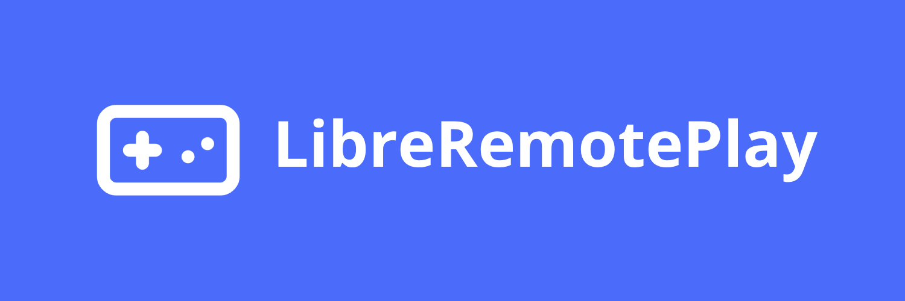

# LibreRemotePlay

> [!IMPORTANT]  
> The software for the moment is very experimental, may not always work an all systems. If you find a bug you can report it on issues page or discord.

> [!NOTE]  
> If you are interested in contributing (code/translations) you can follow [this guide](./CONTRIBUTING.md)

### An open source, free (as in freedom) and P2P alternative to Steam Remote Play

- Website 🌐: https://libreremoteplay.vercel.app/

- Wiki 📖: https://github.com/PiterWeb/LibreRemotePlay/wiki

- Discord Community 👥: https://discord.gg/v7qd7nU3fJ

- Series of WebRTC Articles 👨‍💻: https://dev.to/piterweb/series/30718

## Use cases ✨

- Share your local co-op games online with friends (as [Steam Remote Play Together](https://store.steampowered.com/remoteplay?l=english#together))
- Stream your games from your PC to other devices (as [Steam Remote Play Anywhere](https://store.steampowered.com/remoteplay?l=english#anywhere))

## Download 📦

- https://github.com/PiterWeb/LibreRemotePlay/releases/latest

## Resources 📚

- [Docs](./docs/) 📘
- [Linux Docs](https://github.com/PiterWeb/LibreRemotePlay/wiki/installation-&-execution#execute-in-linux) 📘
- [Wiki](https://github.com/PiterWeb/LibreRemotePlay/wiki) (Guides, FAQ, ...)
- [Discord Community](https://discord.gg/v7qd7nU3fJ)

### Videos 📹
(Note that videos may show older/beta versions of the APP and could have bugs that are already fixed in the latest version)

#### How to use

https://github.com/user-attachments/assets/f4a412fa-f403-4429-85fb-9c1e74bff458

## Features 🧩

- [x] Portable
- [x] Simple & Modern UI
- [x] Interactive Tutorial
- [x] Peer-to-Peer (WebRTC)
- [ ] Groups
- [x] Remote Video Streaming
  - [x] Video Quality Config 
- [x] Browser Client
- [x] Localization (translation to multiple languages)
- [x] Support for custom STUN & TURN servers
- [x] Keyboard (Experimental)
- [x] Toogle Devices
- [x] [EasyConnect](https://github.com/PiterWeb/LibreRemotePlayEasyConnectServer) 

### OS Support 💻

| Windows 	| Linux 	| MacOS 	| Browser (Only Client) 	|
|---------	|-------	|-------	|---------	|
| ✔       	| ✔     	| ❌ (No MacOS to test/develop)     	| ✔ (Known Issues with Safari)       	|

### Gamepad Support 🎮

| PC Controller (XInput/DirectInput) 	| Xbox Controller (XInput) 	| PlayStation Controler
|---------	|-------	|-------	|
| ✔       	| ✔     	| ❌ (But you can achieve [emulating a Xbox Controller](https://github.com/Ryochan7/DS4Windows))     	|

### Available Languages 🔠

| English 	| Spanish 	| Galician | Russian | French |Other languages |
|---------	|-------	|-------	| ------- | ------- | ------- |
| ✔     	| ✔      	| ✔      	| ✔ | ✔ (@Zorkyx22) |⌛ Looking for contributions

## Self Hosting ☁

There is no way to self-host the infrastructure of LibreRemotePlay because it has no backend. But instead you can self-host if you want the TURN & STUN servers and then add them to the config or the [EasyConnectServer](https://github.com/PiterWeb/LibreRemotePlayEasyConnectServer).

- If you want to self-host a TURN/STUN server you can [try Coturn](https://github.com/coturn/coturn). (This is only an example, you can choose other STUN/TURN implementations)

- Also you can host the Web version (but it is only frontend, so is not very usefull)

- If you want to self-host an EasyConnectServer you can follow the docs of [EasyConnectServer repo](https://github.com/PiterWeb/LibreRemotePlayEasyConnectServer), this service is also packed in the desktop app and run in app startup but instead you can launch it along. EasyConnectServer is a signaling server that makes code passing in an automatic way.

## Run Dev

### Prerequisites

- You must have [Task CLI](https://taskfile.dev/installation/), [Wails CLI](https://wails.io/docs/gettingstarted/installation#installing-wails), [NodeJS (~v20.x.x)](https://nodejs.org/en/download), [pnpm](https://pnpm.io/en/installation) and [Golang (min v1.22.4)](https://go.dev/doc/install) installed.

- Make sure to run `wails doctor` and [install all the required dependencies for your system](https://wails.io/docs/gettingstarted/installation#system-check), also take a look at [platform specific dependencies](https://wails.io/docs/gettingstarted/installation/#platform-specific-dependencies)

### How to

Go to the root project folder and run

  - Full App :

    `$ task dev-all`

  - Frontend:

    `$ task dev-front`

## Build

### Prerequisites

- You must have [Task CLI](https://taskfile.dev/installation/), [Wails CLI](https://wails.io/docs/gettingstarted/installation#installing-wails), [NodeJS (~v20.x.x)](https://nodejs.org/en/download), [pnpm](https://pnpm.io/en/installation) and [Golang (min v1.22.4)](https://go.dev/doc/install) installed.

- Make sure to run `wails doctor` and [install all the required dependencies for your system](https://wails.io/docs/gettingstarted/installation#system-check), also take a look at [platform specific dependencies](https://wails.io/docs/gettingstarted/installation/#platform-specific-dependencies)

### How to

Go to the root project folder and run

- For general builds:

    `$ task build`

- For Windows builds:

    `$ task build-win`

- For Linux builds:

    `$ task build-linux`
    
- For Linux AppImage builds (experimental):
  
    `$ task build-linux`
    and then
    `$ task build-linux-appimage`

finally go to the build/bin folder and your executables will be there.

> [!Note]
> Please note the supported platforms in the table

## Contributting 🤝

If you are interested to contribute to this project you can follow this [guide](./CONTRIBUTING.md)

## Acknowledgements ❤
These projects are making LibreRemotePlay a reality.

### Thanks to jbdemonte/virtual-device
[jbdemonte/virtual-device](https://github.com/jbdemonte/virtual-device) is the source of magic that enables LibreRemotePlay to generate virtual gamepads on Linux, is very fast and made in pure Go.
### Thanks to the ViGEm project
[ViGEmBus](https://github.com/nefarius/ViGEmBus) is the source of magic that enables LibreRemotePlay to generate virtual gamepads on Windows. We embed ViGEmBus Installation Wizard and ViGEmBus Client DLLS within the executable for Windows

### Thanks to Wails
[Wails](https://github.com/wailsapp/wails) makes easy creating desktop experiences using Go and Web tecnologies.

### Thanks to pion/webrtc
[Pion/Webrtc](https://github.com/pion/webrtc) is a implementation of WebRTC made in pure Go, it enables LibreRemotePlay to use WebRTC in a crossplatform way.

### Thanks to robotgo
[robotgo](https://github.com/go-vgo/robotgo) makes easy controling/simulating a keyboard (and anything related to desktop) using a simple syntax in Go.

## Did you like the project 👍 ?
You can give us a star and join our [Discord Community](https://discord.gg/v7qd7nU3fJ), the project is always looking for feedback :)

## Are you interested in other gaming projects 🤔? 

 

You may be interested in [GameLinkSafeCLI](https://github.com/PiterWeb/GameLinkSafeCLI) is like ngrok but works with TCP/UDP without account and no need to self-host in normal enviroments. 
Can be used like a hamachi alternative for gamers who are familiar with CLIs.

## Star History
Here you can see how fast the community is growing
 

