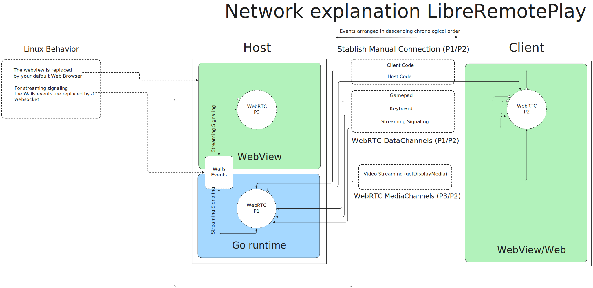

# Docs 📘

## Network related


[Link to the image](./network_explanation_diagram.svg)

## General 

LibreRemotePlay uses web technologies like WebRTC and MediaDevices (displayMedia).

WebRTC is totally supported by all main desktop/mobile browsers and is also available in different languages (Go included)

The purpose of WebRTC is to make a P2P connection between Host and Client devices to send Gamepad Input using data channels and also captured Video/Audio with media channels. 

DisplayMedia is for capturing video/audio from desktop/aplications and them stream it through WebRTC media channel.

### Wails 

This project is using Wails so it might be important to know how wails works.

Wails is like Electron but for Go, and instead of embed a Chromium Browser you will use the existent browser of you OS (webview2, gtkwebview, ...). 

You will have two parts:
- "Browser":
  This is what runs HTML, CSS, JS, TS, WASM (provides the UI)
- "Desktop APP":
  This is what runs Go code

#### Bindings

Wails can generate bindings in JS for Go generated functions. <br>

In the project all bindings are located in [/src/desktop/](../src/desktop/)

Real example:

This function located in [/src/desktop/app.go](../src/desktop/app.go)

```go
func (a *App) GetCurrentOS() string {
  return strings.ToUpper(runtime.GOOS)
}
```
will appear as

```js
export function GetCurrentOS() {
  return window['go']['desktop']['App']['GetCurrentOS']();
}
```

in the path [/frontend/src/lib/wailsjs/go/desktop/App.js](../frontend/src/lib/wailsjs/go/desktop/App.js)

#### Events

Wails have listeners and event dispatchers to send data between JS <-> GO in a bidirectional flow (this are contained in the wails runtime pkg)

## Roles

First make sure to read the Wails section above.

We are going to start with ¿ How the two roles communicate ?.

To not enter in WebRTC matery we are going to say that each peer needs to need some information from the other after the connection begins so we need to pass that information.<br><br>
To do that we share codes, this codes are simply the data needed by WebRTC but encoded and compressed to be the most portable it can, to not require the use of a signaling server. This way you will not have to self-host any serice.

Note: all the "codes" encoding & compression is done in Go or Wasm (generated from the Go code).

### Client

Client code is only located on the "Browser" (JS/TS).

The logic is very simple. The client creates a WebRTC connection with the host and through the Gamepad API of the "Browser" gets the gamepad data, later we copy the structure and send using a WebRTC Datachannel.
If there is an available Screen + Audio stream we can connect to it creating a new WebRTC connection and using the previous as signaling server. The render of the stream is all done using Web APIs.

### Host

Host is the most complex role cause part of the logic of webrtc code is on the "Browser" and other in "Desktop APP".

This division of logic is because we need:
  - Go: A WebRTC connection that goes directly to the ViGEm driver (which is loaded as a DLL in Go) to insert the gamepad data or a similar situation with keyboard.

  - JS/TS: We need to send the Screen + Audio stream to the client. To do that we need the WebRTC stream in the "Browser", one way of achieve this could have been doing a rtp stream proxy and use the Go WebRTC connection but that would have add latency and use of more resources. Because of that it is created a new WebRTC connection only for the stream on the "Browser", this connection is auto created and uses as signaling service the normal WebRTC connection used for Gamepad data.


## Frontend (Browser)

Source code location : [/frontend/](../frontend)

WebRTC code: [/frontend/src/lib/webrtc/](../frontend/src/lib/webrtc)

### [Frontend Docs](./FRONTEND.md)

### Stack:

- 💻 Sveltekit  (UI Framework)
- ✨ Tailwind  (CSS Framework)
- 💅 DaisyUI  (Tailwind Framework)
- 🔢 WASM (for Go compatibility) 
- 🔠 Svelte i18n (Translations) 
- 📦 Wails (Golang bindings for desktop)

## Backend (Dekstop APP Logic)

Source code location: [/main.go](../main.go) + [/src/](../src)

WebRTC code: [/src/net/](../src/net) + [/src/streaming_signal/](../src/streaming_signal/)

### [Backend Docs](./BACKEND.md)

### Stack:

- 💻 Go
- 📦 Wails (Desktop APP)
- 🌐 Pion/Webrtc
- 🎮 ViGEm (binary & dll for gamepad virtualization)